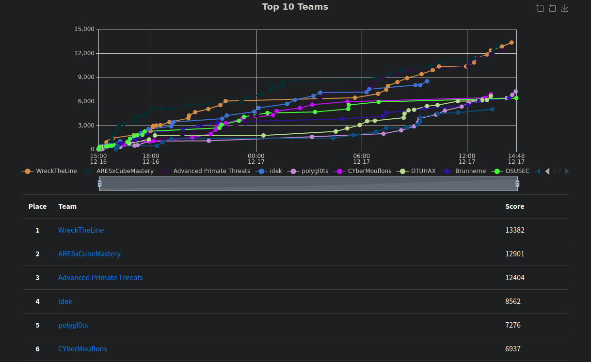

# NahamConEU22

## About

This repo is a collection of files and writeups for the NahamCon EU 2022 CTF competition. My team, ARESxCubeMastery held the lead for nearly the entire competition but unfortunately was pushed into second place in the last hour. It was still fun competition with plenty of very interesting challenges!

## Challenges

Challenges marked with :white_check_mark: have a writeup available.

### Warmups

* [Arjeebee](challenges/Warmups/arjeebee/) <em>(easy)</em>
* [Banjo](challenges/Warmups/banjo/) <em>(easy)</em>
* [catscii](challenges/Warmups/catscii/) <em>(easy)</em>
* [Hashstation](challenges/Warmups/hashstation/) <em>(easy)</em>
* [Read The Rules](challenges/Warmups/read-the-rules/) <em>(easy)</em>
* [Way 2 Basic](challenges/Warmups/way-2-basic/) <em>(easy)</em>
* [Baby's First Heartbleed](challenges/Warmups/babys-first-heartbleed/) <em>(easy)</em>
* [Technical Support](challenges/Warmups/technical-support/) <em>(easy)</em>
### Reverse Engineering

* [padlock](challenges/ReverseEngineering/padlock/) <em>(easy)</em>
* [rick](challenges/ReverseEngineering/rick/) <em>(easy)</em>
* [Go Jargon Go](challenges/ReverseEngineering/go-jargon-go/) <em>(hard)</em>
* [Vasily's Pride](challenges/ReverseEngineering/vasilys-pride/) <em>(hard)</em>
### Cryptography

* [dont_hack_my_d](challenges/Cryptography/donthackmyd/) <em>(easy)</em>
* [Shapeshifter](challenges/Cryptography/shapeshifter/) <em>(easy)</em> :white_check_mark:
* [rektcursion](challenges/Cryptography/rektcursion/) <em>(hard)</em>
### Web

* [Byepass](challenges/Web/byepass/) <em>(medium)</em>
* [Dogos](challenges/Web/dogos/) <em>(hard)</em>
* [Use After Exit](challenges/Web/use-after-exit/) <em>(medium)</em>
* [Dirty Bird 2](challenges/Web/dirty-bird-2/) <em>(hard)</em>
* [Flink](challenges/Web/flink/) <em>(medium)</em>
* [Chatter](challenges/Web/chatter/) <em>(hard)</em>
* [Recurse CTF](challenges/Web/recurse-ctf/) <em>(hard)</em>
### Miscellaneous

* [The Space Between Us](challenges/Miscellaneous/the-space-between-us/) <em>(medium)</em>
* [MMORPG](challenges/Miscellaneous/mmorpg/) <em>(easy)</em>
* [CLEAVE](challenges/Miscellaneous/cleave/) <em>(hard)</em>
* [Squid Game](challenges/Miscellaneous/squid-game/) <em>(medium)</em>
### Scripting

* [Math Smasher](challenges/Scripting/math-smasher/) <em>(medium)</em>
### Networking

* [IP Man](challenges/Networking/ip-man/) <em>(easy)</em>
### Binary Exploitation

* [Hexploit](challenges/BinaryExploitation/hexploit/) <em>(easy)</em>
* [The Imagicator Redux](challenges/BinaryExploitation/the-imagicator-redux/) <em>(medium)</em>
* [The Imagicator](challenges/BinaryExploitation/the-imagicator/) <em>(medium)</em>
* [The Imagicator - Family Friendly](challenges/BinaryExploitation/the-imagicator-family-friendly/) <em>(hard)</em>
* [Limited Resources](challenges/BinaryExploitation/limited-resources/) <em>(hard)</em>
* [Wacky Service](challenges/BinaryExploitation/wacky-service/) <em>(easy)</em>
* [The Imagicator - Almost Family Friendly](challenges/BinaryExploitation/the-imagicator-almost-family-friendly/) <em>(hard)</em>
### Mobile

* [Got Any Games?](challenges/Mobile/got-any-games/) <em>(hard)</em>
### DevOps

* [RaaS](challenges/DevOps/raas/) <em>(medium)</em>
* [Dizzy](challenges/DevOps/dizzy/) <em>(hard)</em>
### Web3

* [Welcome](challenges/Web3/welcome/) <em>(easy)</em>
* [Merkle Heist](challenges/Web3/merkle-heist/) <em>(easy)</em>
* [Jump](challenges/Web3/jump/) <em>(medium)</em>
* [NFT Lottery](challenges/Web3/nft-lottery/) <em>(medium)</em>
* [Broken Storage](challenges/Web3/broken-storage/) <em>(hard)</em>
* [Proposal Unlock](challenges/Web3/proposal-unlock/) <em>(medium)</em>
* [Sigma](challenges/Web3/sigma/) <em>(hard)</em>
* [NFT Lottery Revisited](challenges/Web3/nft-lottery-revisited/) <em>(hard)</em>
### Hardware/RF

* [Darren's Circuit](challenges/Hardware/RF/darrens-circuit/) <em>(easy)</em>
* [Project Circuit Breaker](challenges/Hardware/RF/project-circuit-breaker/) <em>(medium)</em>
### Cloud

* [Mode Incognito](challenges/Cloud/mode-incognito/) <em>(hard)</em> :white_check_mark:
