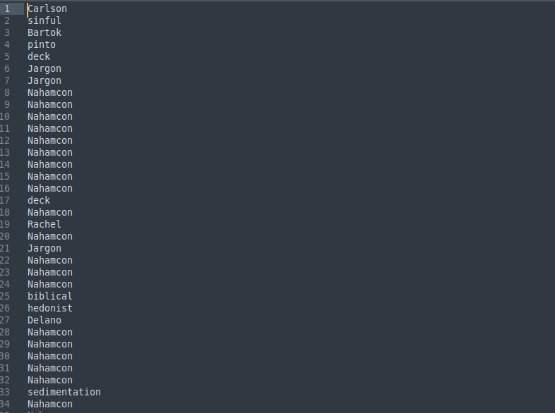
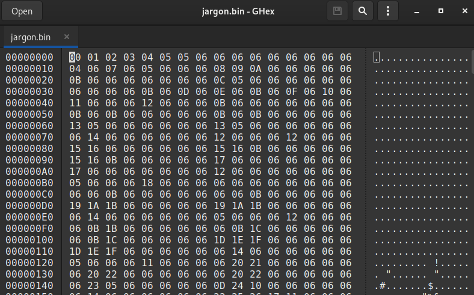
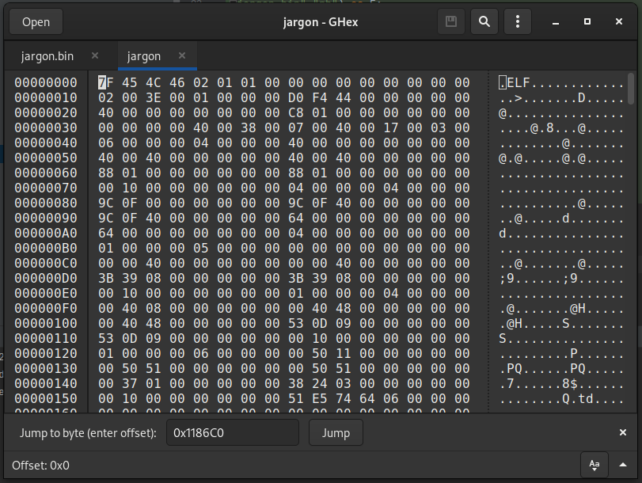

# Go Jargon Go

## Description

<small>Author: @Kkevsterrr#7469</small><br><br>We've gone ahead and pulled this file, but the jargon is just too much for us.<br> <i>Go go gadget reverse engineer</i> - can you understand the jargon and extract the flag? <br><br> <b>Download the files below.</b>


## Files

* [go-jargon-go.txt.7z](files/go-jargon-go.txt.7z)

## Solution

Opening the provided file after extracting the archive, you see that it is 16 mb of seemingly random words. Obviously these can be decoded in some way but we'll need to determine some statistics about the contents of the file.



Iterating through the words, we find that there are exactly 256 unique words in the file, meaning that each word likely maps to a single byte value.

The next step is to covert it to something more meaningful to work with. To do this, I used a script that read through the file and mapped them, in order of appearance to 0-255 to produce a binary file.

```python
with open("go-jargon-go.txt","r") as infile:
    with open("jargon.bin", "wb") as outfile:
        codes = {}
        count = 0
        for line in infile.readlines():
            L = line.strip()
            if L not in codes:
                codes[L] = count
                count += 1
            outfile.write(codes[L].to_bytes(1,"big"))
    infile.close()
    outfile.close()
```

This outputs a file, jargon,bin, which is now a file with actual byte values but still has no meaning until we solve a sort of substitution cipher.
The challenge name and file size, indicate this could possibly be a Golang executable.



So if we want to covert it back to the original file we need to try to identify byte values that we can map back to the correct ones. In this case we can easily use known values like the ELF header to try to get some easy ones. But the rest might be a little trickier.

In nearly any executable, there will be some place where there will be a list of alphanumeric characters. So, I attempted to slide a window across the file looking for segments where there were 62 unique characters in a row. The idea would be that these could possibly be places where I would find [a-zA-Z0-9]

```python
S = "ABCDEFGHIJKLMNOPQRSTUVWXYZabcdefghijklmnopqrstuvwxyz0123456789"

with open("jargon.bin","rb") as F:
    X = F.read()
    for i in range(len(X)-62):
        chunk = [l for l in X[i:i+62]]
        s_chunk = set(chunk)

        # Preview the content if you replaced every char with letters
        if len(chunk) == len(s_chunk):
            X_temp = b''
            
            print("Possible Match Found: %d" % i)

            mapping = {}

            for c,l in zip(chunk,S):
                mapping[c] = ord(l)

            for x in X:
                if x in mapping:
                    X_temp += mapping[x].to_bytes(1,'big')
                else:
                    X_temp += x.to_bytes(1,'big')

            if b'runtime' in X_temp:
                print("Match Confirmed: %d" % i)
                exit()
```

My thought process above was that if the mapping was correct, then common Go strings like "runtime" would appear and confirm I had the correct position. Unfortunately this script was terribly inefficient and was running too slowly to be able to really find anything.
However, it did reveal that there was a section starting at offset **0x1186C0** that matched the quality of having 62 unique characters, but then I noticed the window kept printing out more incremental indexes, meaning that it was actually a larger block of unique bytes.

So I opened the file and went to that offset and found that there actually was a perfect 256 byte block of unique bytes, starting with 0x06. This meant that every possible value was included in that block, and since we could see a lot of 0x06 at the top of the file which likely mapped to 0x00, the block was probably in order from 0x00 to 0xFF.

I saved this segment of 256 bytes to a new file called mapping.bin and then ran a script to use it as my mapping to convert the original file.

```python
M = open("mapping.bin","rb").read()

alphabet = {}

for i,m in enumerate(M):
    alphabet[m] = i

with open("jargon.bin","rb") as F:
    with open("jargon", "wb") as out:
        while True:
            x = F.read(1)
            if x == b'':
                break
            x = ord(x)
            if x in alphabet:
                out.write(alphabet[x].to_bytes(1,'big'))
            else:
                out.write(x.to_bytes(1,'big'))
    F.close()
    out.close()
```

Success! Opening the final file, we see that it is a perfectly decoded ELF executable file!



Running the new executable prints out the flag:

```flag{71c543e175dc562704af34aa0524d1e9}```