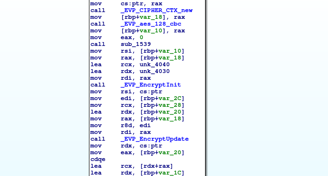
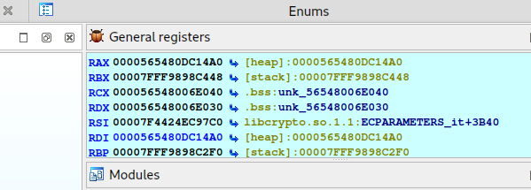
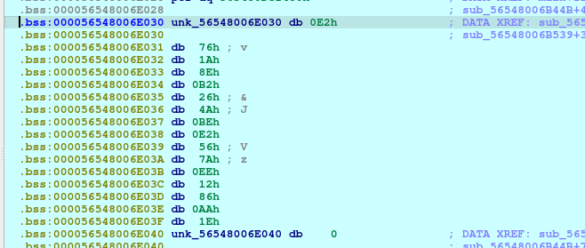
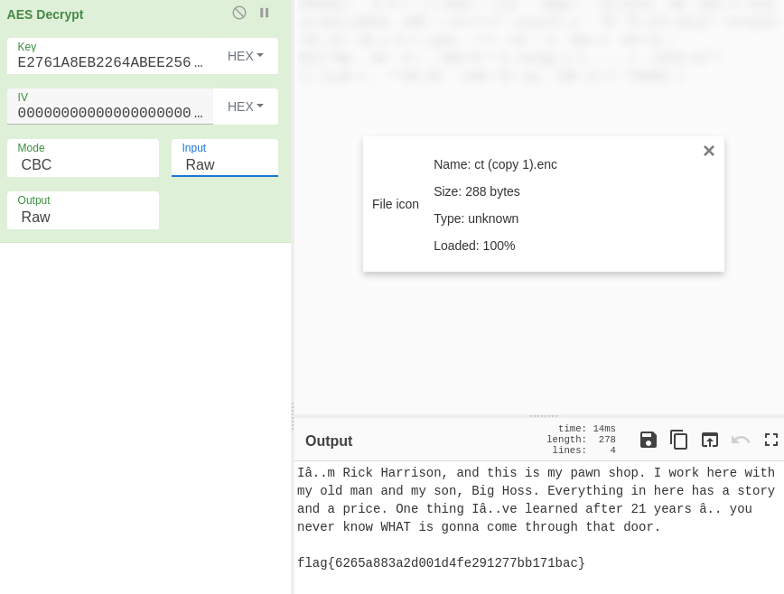

# rick

## Description

<small>Author: @Gary#4657</small><br><br>These files were on a USB I bought from a pawn shop. <br><br> <b>Download the files below.</b>


## Files

* [ct.enc](files/ct.enc)

* [program](files/program)


## Solution

Looking at the provided files, we can assume that the program was used to encrypt ct.enc in some way. Opening it up in IDA, I can see there is a reference to ```_EVP_aes_128_cbc```, so we can tell that the data is likely encoded with AES. Following references to this function, it leads us back to the point in the program where it is called.



Since we aren't really provided anything in the way of a key, it is likely that the key that is used for AES encryption is embedded in the program somewhere.

The easiest way is just to place a break point in this function and run it...

One thing to note is that even though this program will output that it is unable to open flag.txt, it is actually looking for input.txt.

When we run the program and reach the break point, we can continue down to EVP_EncryptInit which accepts parameters for a key and IV.

Looking over at the registers, we can see two references to those parameters in RCX and RDX.



While the IV appears to just be 16 bytes of 0x00, the Key parameter has an actual value.



Now we can just open up the encoded file in CyberChef and past in the hex bytes from the program long with the 0 IV into the AES Decrypt function.



```flag{6265a883a2d001d4fe291277bb171bac}```

