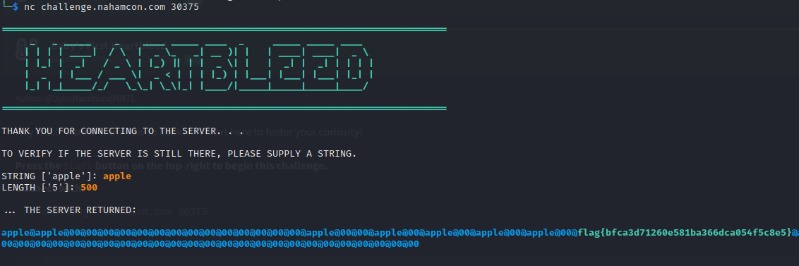

# Baby's First Heartbleed

## Description

<small>Author: @JohnHammond#6971</small><br><br>Hey kids!! Wanna learn how to hack??!?! Start here to foster your curiosity! <br>


## Solution

After starting the service and connecting with ```nc```, you are asked to give a string and then a length. This is a throwback to the Heartbleed vulnerability in OpenSSL which allowed attackers to specify a length longer than the actual data that was provided. So when the server attempted to respond, it would read back the actual data and then leak memory from the server. This would potentially allow for attackers to get private keys and other sensitive data very easily from affected systems.

In order to exploit the service, simply provide a string and then a large number. It will echo back your string and then some additional data including the flag that is in memory.



```flag{bfca3d71260e581ba366dca054f5c8e5}```


